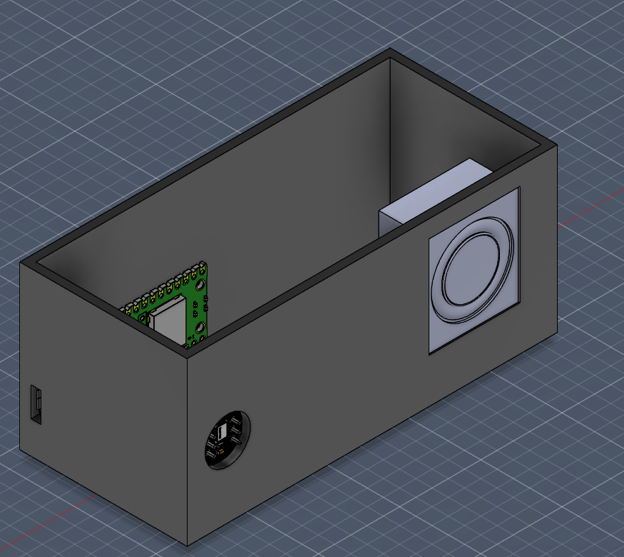
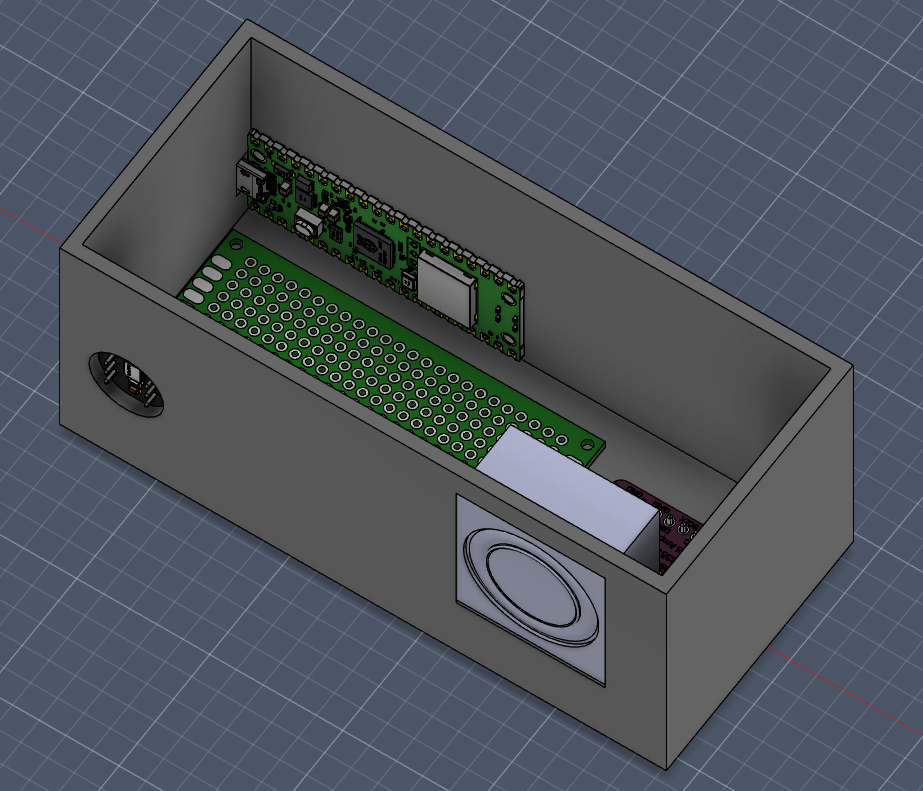

# Inter-House-Communication-System
Inter house communication device, well, a system of devices, 
IHCS for short, which can communicate between houses, 
so friends who are maybe long distance or just like each other's company, 
they can talk as if they are in the same room.

CAD Render
---

BOM
---
| Name                    | Purpose                                                  | Quantity | Total Cost (USD) | Link                                                           | Distributor          |
|:------------------------|:---------------------------------------------------------|:---------|:-----------------|:---------------------------------------------------------------|:---------------------|
| Dotted Vero Board       | Wire handling                                            | 4        | 10.00            | [Link](https://besomi.com/ae_en/catalog/product/view/id/5506)  | Besomi               |
| 3 Watt, 8 Ohm Speakers  | Output Audio                                             | 4        | 12.00            | [Link](https://ar.aliexpress.com/item/1005008267342362.html)   | AliExpress           |
| INMP441 I2S Amplifier   | Amplifies audio recieved                                 | 4        | 8.00             | [Link](https://ar.aliexpress.com/item/1005009182912928.html)   | AliExpress           |
| MAX98357 I2C Microphone | Capture Audio                                            | 4        | 6.00             | [Link](https://ar.aliexpress.com/item/1005007629020891.html)   | AliExpress           |
| 32 GB Micro SD Card     | Housing software for the Raspberry Pi Zeros.             | 2        | 15.00            | [Link](https://besomi.com/ae_en/catalog/product/view/id/12529) | Raspberry Pi, Besomi |
| Raspberry Pi Zero 2 W   | Send and recieve audio from and to hubs and nodes        | 2        | 80.00            | [Link](https://www.amazon.ae/gp/product/B0DB2JBD9C)            | Raspberry Pi, Besomi |
| Raspberry Pi Pico 2 W   | Recieve and Send Audio to and from the hub and play them | 4        | 43.00            | [Link](https://besomi.com/ae_en/catalog/product/view/id/12862) | Raspberry Pi, Besomi |
